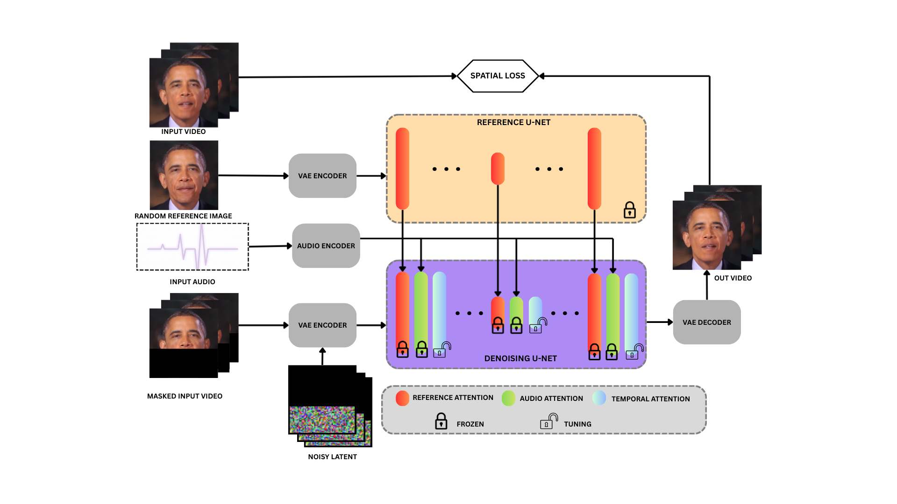

<h1 align='center'>HighSync: High-Quality Lip Synchronization via
Latent Diffusion Models</h1>

<div align='center'>
    <a href='https://github.com/saeed5959' target='_blank'>Saeed Firouzi</a><sup>1</sup>&emsp;
</div>

<br>

<div align='center'>
    <a href='https://huggingface.co/saeed-5959/high_sync'></a>
    <a href='https://arxiv.org/abs/2605.16918'></a>
    <a href='https://huggingface.co/datasets/saeed-5959/vfhq'></a>
</div>


## Abstraction
We present HighSync, an end-to-end diffusion-based
framework for high-fidelity lip synchronization that generates
photorealistic talking-face videos aligned with arbitrary input
audio. Existing approaches consistently struggle to reconcile
image quality with synchronization accuracy, producing either
visually degraded outputs or temporally inconsistent lip move-
ments. HighSync addresses both challenges simultaneously and,
to our knowledge, is the first lip sync model to operate natively
at 512×512 resolution, positioning it as a viable solution for
professional production environments such as the film and broad-
cast industries. Central to our approach is the identification and
systematic elimination of a data leakage phenomenon that has
silently undermined temporal modeling in prior work, preventing
models from developing a genuine dependence on the audio
signal. Comprehensive evaluations across both perceptual quality
and synchronization accuracy metrics confirm that HighSync
achieves state-of-the-art performance on both fronts.


## Model Structure



## ⚒️ Installation

### Environment

    Ubuntu 20 or 22

### Download the Codes

```bash
  git clone https://github.com/saeed5959/high_sync
  cd high_sync
```


### Install packages with `pip`
```bash
  pip install -r requirements.txt
```

### Install ffmpeg
```bash
apt-get install ffmpeg
```

### Download pretrained weights

```shell
git lfs install
git clone https://huggingface.co/saeed-5959/high_sync pretrained_weights
```

The **pretrained_weights** is organized as follows.

```
./pretrained_weights/
├── denoising_unet-500.pth
├── reference_unet-500.pth
├── sd-vae-ft-mse
│   └── ...
├── sd-image-variations-diffusers
│   └── ...
└── audio_processor
    └── whisper_tiny.pt
```

In which **denoising_unet.pth** / **reference_unet.pth** / are the main checkpoints of **Highsync**. Other models in this hub can be also downloaded from it's original hub, thanks to their brilliant works:
- [sd-vae-ft-mse](https://huggingface.co/stabilityai/sd-vae-ft-mse)
- [sd-image-variations-diffusers](https://huggingface.co/lambdalabs/sd-image-variations-diffusers)
- [audio_processor(whisper)](https://openaipublic.azureedge.net/main/whisper/models/65147644a518d12f04e32d6f3b26facc3f8dd46e5390956a9424a650c0ce22b9/tiny.pt)

### Inference

1)First convert your video to fps=25

```bash
ffmpeg -i input.mp4 -r 25 out_25.mp4
```

2)Then run the python inference script:

```bash
  python -m inference --source_video "video_path.mp4" --driving_audio "audio_path.wav" --output "save_path.mp4"
```

### Dataset
We preprocessed 3 public datasets and put their clean videos in these links :

[VFHQ](https://huggingface.co/datasets/saeed-5959/vfhq)

[Celebv-HQ](https://huggingface.co/datasets/saeed-5959/celebv_hq_head_talking)

[HDTF](https://huggingface.co/datasets/saeed-5959/hdtf)

Notice : thses videos has been preprocessed based on the paper appraoch!

## 🙏🏻 Acknowledgements

This work is mainly based on [EchoMimic](https://github.com/antgroup/echomimic) work.

We would like to thank the contributors to the [EchoMimic](), [AnimateDiff](https://github.com/guoyww/AnimateDiff), [Moore-AnimateAnyone](https://github.com/MooreThreads/Moore-AnimateAnyone) and [MuseTalk](https://github.com/TMElyralab/MuseTalk) repositories, for their open research and exploration.

We are also grateful to [V-Express](https://github.com/tencent-ailab/V-Express) and [hallo](https://github.com/fudan-generative-vision/hallo) for their outstanding work in the area of diffusion-based talking heads.

If we missed any open-source projects or related articles, we would like to complement the acknowledgement of this specific work immediately.

## Citation
```bibtex
@article{daghigh2024highsync,
  title={HighSync: High-Quality Lip Synchronization via Latent Diffusion Models},
  author={Saeed Firouzi Daghigh and Majid Iranpour Mobarekeh and Mostafa Alavi and Mehdi Bagheri},
  journal={arXiv preprint arXiv:2605.16918},
  year={2026}
}
```


## 🌟 Star History
[](https://star-history.com/#saeed_5959/highsync&Date)
